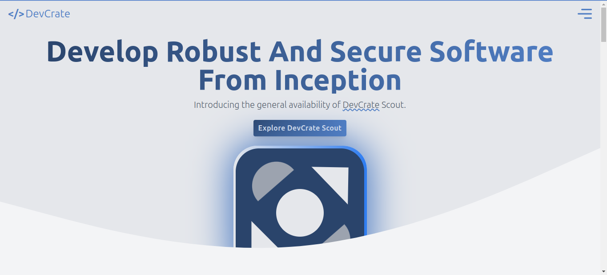

# Devcrate

Welcome to Devcrate, a personal project crafted for implementing and refining Tailwind CSS knowledge. Explore this project as a demonstration of Tailwind CSS utilities and techniques used in crafting sleek and responsive user interfaces. Delve into the world of modern web development through Devcrate and enhance your skills in utilizing Tailwind CSS effectively.

## Description

Devcrate is a personal project aimed at implementing and refining Tailwind CSS knowledge. Through this project, individuals can explore practical implementations of Tailwind CSS utilities, gaining hands-on experience in creating modern web interfaces. Whether you're a beginner looking to delve into Tailwind CSS or an experienced developer seeking to refine your skills.

## Features

- Practical implementation of Tailwind CSS utilities.
- Responsive design practices

## Website URL

Visit [Devcrate](https://devcrate.vercel.app) to see this project live.

## Technologies Used

- HTML
- CSS (Tailwind CSS)
- JavaScript

## Usage

To explore Devcrate's projects and gain practical experience in using Tailwind CSS, follow these steps:

1.  Fork the Devcrate repository by clicking the "Fork" button on GitHub.

2.  Clone your forked repository to your local machine:

    ```
    git clone <your-forked-repository-url>
    ```

3.  Navigate to the project directory:

    ```
    cd devcrate
    ```

4.  Install dependencies:

    ```
    npm install
    ```

5.  Open the project in your preferred code editor.

6.  Explore the `index.html` file and associated CSS files to understand the structure and styling of the project.

7.  Experiment with customizations by modifying the existing code snippets or adding new elements.

8.  Use the provided instructions and comments within the code to guide your learning process.

9.  Preview your changes in a web browser to see the impact on the design and layout.

10. To run the project in development mode, use the following command:

        ```
        npm run dev
        ```

    This command will convert Tailwind CSS classes to raw CSS into ./output/tailwind.css.

11. To build the project for production, use the following command:

    ```
    npm run production-build
    ```

This command will minify Tailwind CSS classes into ./output/tailwind.min.css.

Happy coding!

## Screenshots



## Author

- [Tufan Mulla](https://www.tufanmulla.com)
- Email: tufanmulla@yahoo.com

## License

This project is licensed under the MIT License. See the [LICENSE](LICENSE) file for details.

## Feedback and Contributions

Feedback and contributions are welcome! If you have suggestions for improving Devcrate or would like to contribute to its development, feel free to open an issue or submit a pull request.

## Acknowledgments

- [Tailwind CSS Documentation](https://tailwindcss.com/docs)
- [Vercel](https://vercel.com/)
